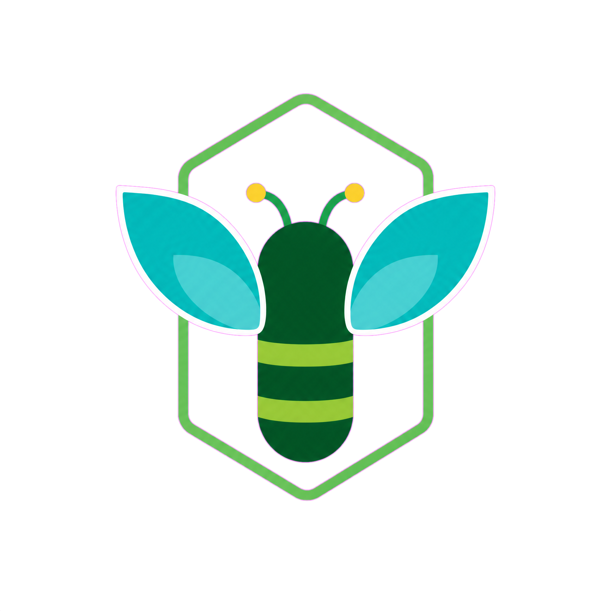
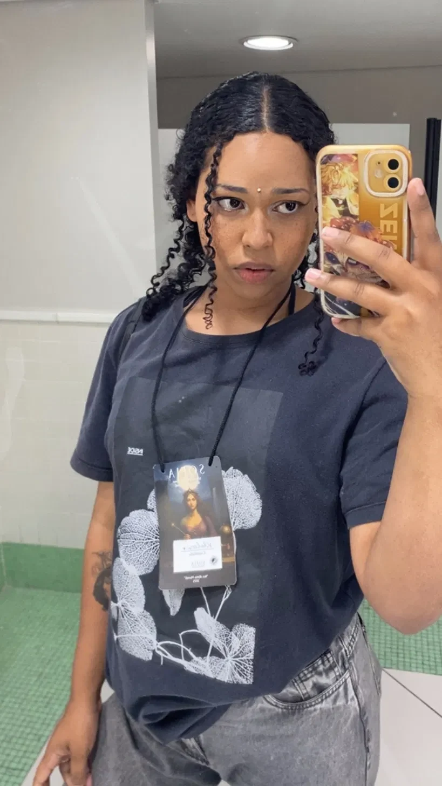
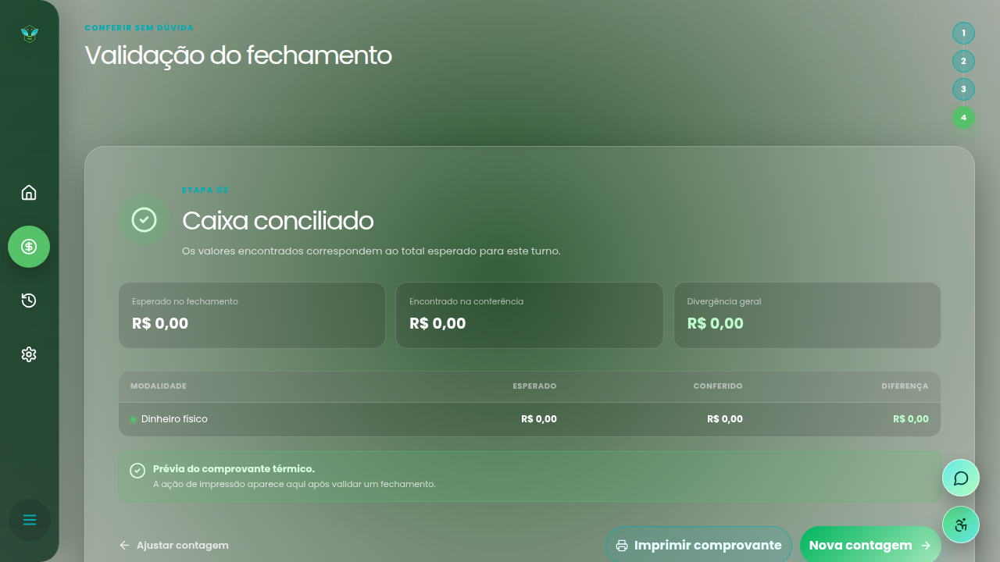
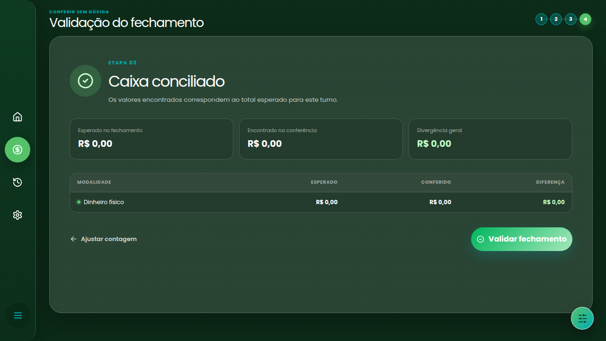
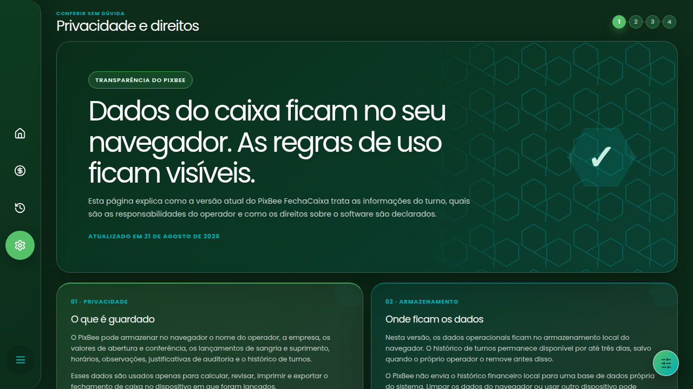
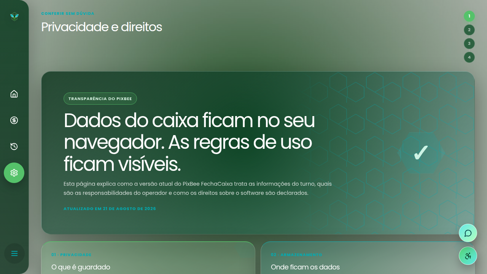
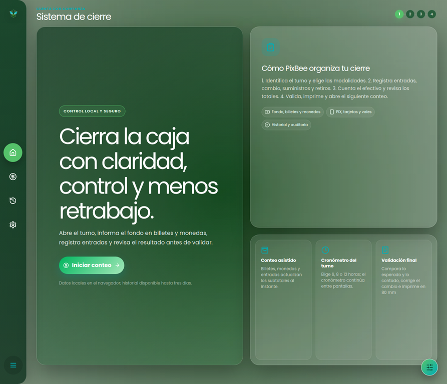
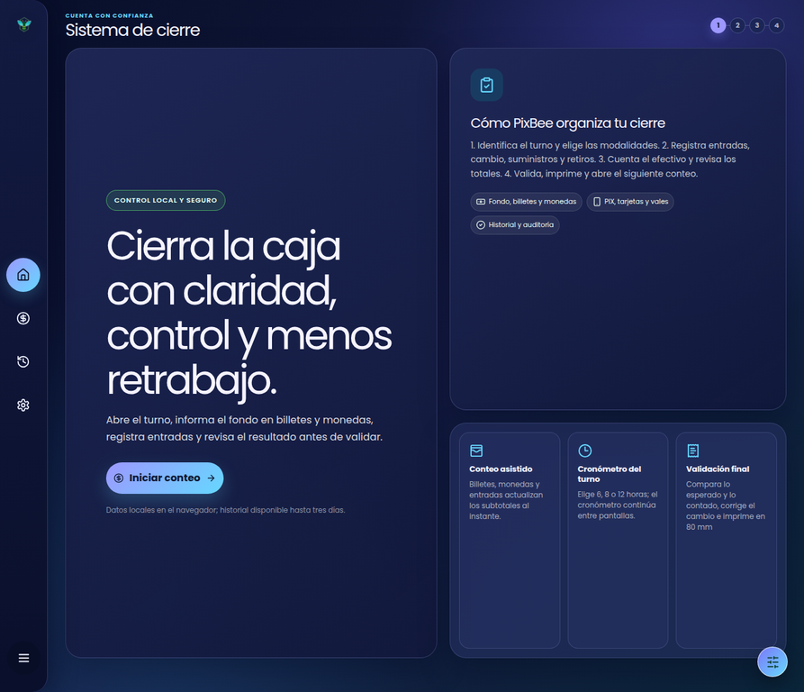
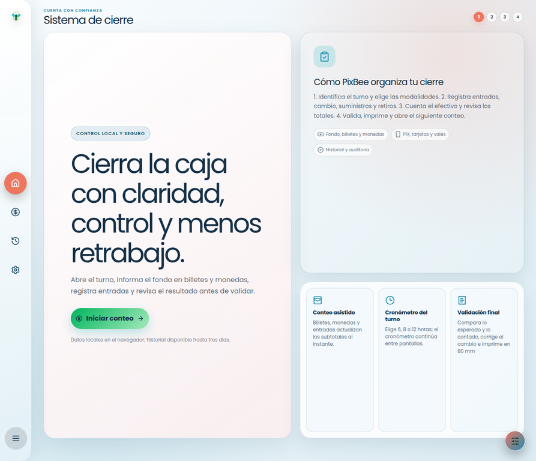

<p align="center">
  
</p>

<h1 align="center">Khaleesi Saithen</h1>

<p align="center">
  <strong>Ciência de Dados · Tecnologia · IA · Produtos com personalidade</strong>
</p>

<p align="center">
  Transformando curiosidade em código, problemas reais em projetos e cada commit em mais um passo da minha evolução.
</p>

<p align="center">
  <a href="https://pixbee-red.vercel.app/">
    
  </a>
  <a href="https://github.com/Khaleesisaithe">
    
  </a>
  <a href="https://www.linkedin.com/in/khaleesisaithen">
    
  </a>
</p>

<p align="center">
  
  
  
</p>

<p align="center">
  
</p>

> **Cada commit é um passo mais perto da minha melhor versão.**

## 👩‍💻 Sobre mim



Sou **Khaleesi Saithen**, uma pessoa curiosa, inquieta e movida pela vontade de aprender, construir e transformar problemas reais em soluções.

Minha trajetória não começou diretamente na tecnologia. Passei por atendimento, operações e varejo — experiências que me ensinaram que, antes de criar uma tecnologia, é preciso entender o problema de quem realmente vai utilizá-la.

Hoje estou construindo minha trajetória em **Ciência de Dados**, estudando Python, análise de dados, desenvolvimento web, bancos de dados, inteligência artificial e outras áreas que me permitem transformar ideias em projetos reais.

Gosto de aprender fazendo. Quando encontro um problema, dificilmente consigo apenas pensar que alguém deveria resolvê-lo; normalmente, pouco depois, já estou tentando construir alguma coisa.

<br clear="right" />

## 🚀 O que me move

Não quero apenas aprender ferramentas. Quero compreender como a tecnologia pode melhorar processos, automatizar tarefas, organizar informações e transformar dados em decisões mais claras.

Foi dessa forma que nasceu o **PixBee FechaCaixa**: uma solução construída a partir de uma necessidade operacional real para tornar o fechamento e a conferência de caixas mais organizados, claros e rastreáveis.

Meu objetivo é unir **tecnologia, criatividade, independência e propósito** em produtos que tenham utilidade no mundo real — mesmo quando o caminho envolve estudar algo novo, errar, corrigir e tentar novamente.

<p align="center">
  
</p>

## 🧠 Meus interesses

| Área | O que estou explorando |
| --- | --- |
| **Dados** | Python, análise, visualização, estatística e construção de uma base sólida em Ciência de Dados. |
| **Inteligência** | Inteligência Artificial, automação e novas formas de transformar problemas em soluções. |
| **Desenvolvimento** | Desenvolvimento web, bancos de dados, APIs e projetos funcionais de ponta a ponta. |
| **Infraestrutura** | Redes, segurança da informação, organização de sistemas e boas práticas técnicas. |
| **Criatividade** | Interfaces, experiências digitais, design, games, cultura digital e estética gótica. |
| **Experimentação** | Tecnologias novas, ideias improváveis e projetos que tenham personalidade própria. |

> Aprender não precisa acontecer em uma linha reta. Às vezes o caminho passa por Python, depois por HTML, depois por uma ideia às duas da manhã e, misteriosamente, termina em um projeto funcionando.

## 🐝 Projeto em destaque: PixBee FechaCaixa

O PixBee FechaCaixa é uma aplicação web criada para simplificar a **abertura, contagem, conferência e finalização de turnos de caixa**. A proposta é transformar uma rotina manual e sujeita a erros em um processo mais claro, rastreável e seguro.

<p align="center">
  <a href="https://pixbee-red.vercel.app/">
    
  </a>
</p>

| Etapa | O que o sistema entrega |
| --- | --- |
| **Abertura** | Registra empresa, operador, fundo inicial e modalidades que serão conferidas. |
| **Contagem** | Organiza cédulas, moedas, Pix, cartões e entradas acumuladas em espécie. |
| **Movimentações** | Controla sangrias e suprimentos com horário, justificativa e trilha de auditoria. |
| **Conciliação** | Compara o valor esperado com o valor encontrado e mostra sobra ou falta por modalidade. |
| **Comprovantes** | Gera relatório em PDF e prepara impressão térmica Epson em bobina de 80 mm. |
| **Acessibilidade** | Oferece alto contraste, temas persistentes e alternância entre Português, English e Español. |

### O que estou construindo com esse projeto

O PixBee representa mais do que uma aplicação funcionando. Ele é um exercício prático de produto, investigação de problemas, modelagem de fluxos, experiência de uso e evolução contínua.

A aplicação mantém os dados operacionais no navegador, registra a auditoria das movimentações e preserva o histórico local por até três dias, com opções de impressão e exportação antes da limpeza assistida.

## 🛠️ Tecnologias do projeto

<p align="center">
  
</p>

<p align="center">
  
  
  
  
  
  
  
</p>

| Camada | Recursos presentes |
| --- | --- |
| **Interface** | React 19, TSX, Tailwind CSS 4, Wouter, Radix UI, shadcn/ui, Lucide e Sonner. |
| **Estado e validação** | Context API, Zod, Nano ID, SuperJSON e TanStack Query. |
| **Relatórios** | jsPDF, impressão do navegador e layout de comprovante térmico. |
| **Qualidade** | Vitest, TypeScript, Prettier, esbuild, tsx, pnpm e Vite. |
| **Publicação** | GitHub, GitHub Codespaces e Vercel. |

## 📚 O que estou estudando

<p align="center">
  
  
  
  
  
  
  
</p>

Estou construindo minha base em dados, programação e inteligência artificial ao mesmo tempo em que desenvolvo projetos próprios. Mais do que acumular tecnologias, quero aprender a escolher as ferramentas certas para cada problema.

## 🖥️ Prévia do PixBee

<details open>
<summary><strong>Ver telas e experiências do produto</strong></summary>

<p align="center">
  
  
</p>

<p align="center">
  
  
</p>

<p align="center">
  
  
  
</p>

</details>

## 📊 GitHub em construção

Meu GitHub não representa uma história pronta. Ele representa minha evolução: cada repositório, projeto, erro, commit e tecnologia aprendida faz parte do processo de construir minha carreira enquanto construo a mim mesma como profissional.

<p align="center">
  
  
</p>

<p align="center">
  
</p>

## 🧩 Minha trajetória

Minha trajetória não foi construída em linha reta. Precisei aprender enquanto trabalhava, lidar com mudanças, recomeçar algumas vezes e descobrir meu espaço em uma área competitiva.

Também aprendi que não saber alguma coisa não significa ser incapaz. Significa apenas que existe mais uma coisa para estudar. Cada projeto concluído representa mais do que código funcionando: representa uma prova de que consegui aprender aquilo que antes não sabia fazer.

Entre as conquistas de que mais me orgulho estão iniciar minha formação em Ciência de Dados, construir projetos próprios do zero, criar soluções baseadas em problemas reais, desenvolver meu portfólio e continuar evoluindo mesmo quando o caminho fica mais difícil do que deveria.

<p align="center">
  
</p>

## 🎯 Onde quero chegar

Quero construir uma carreira sólida em **Ciência de Dados, tecnologia e Inteligência Artificial**, trabalhando com problemas reais e criando soluções que tenham impacto.

No longo prazo, quero criar produtos, sistemas e soluções próprias; aprofundar meus conhecimentos em dados, programação e IA; desenvolver uma visão cada vez mais estratégica; e construir uma carreira que una tecnologia, criatividade, independência e propósito.

### Atualmente

| Status | Em movimento |
| --- | --- |
| **Estudando** | Ciência de Dados, Python, análise de dados, IA e desenvolvimento. |
| **Construindo** | Projetos próprios, portfólio e soluções digitais. |
| **Explorando** | Automação, inteligência artificial e novas formas de transformar problemas reais em tecnologia. |
| **Objetivo** | Tornar-me uma profissional cada vez mais completa em dados e tecnologia. |
| **Processo** | Aprendendo → construindo → errando → corrigindo → evoluindo. |

## 📬 Vamos conversar

<p align="center">
  <a href="https://khaleese-portifolio.vercel.app/">
    
  </a>
  <a href="https://www.linkedin.com/in/khaleesisaithen">
    
  </a>
  <a href="https://github.com/khaleesisaithe">
    
  </a>
  <a href="https://pixbee-red.vercel.app/">
    
  </a>
</p>

## ⚙️ Executar localmente

```bash
git clone https://github.com/Khaleesisaithe/Pixbee-FechaCaixa.git
cd Pixbee-FechaCaixa
pnpm install
pnpm dev
```

Para validar o projeto antes de uma publicação, os comandos principais são:

```bash
pnpm check
pnpm test
pnpm build
```

A documentação técnica complementar está disponível em [`docs/architecture.md`](./docs/architecture.md), e as orientações de publicação ficam em [`docs/github-vercel.md`](./docs/github-vercel.md).

## 🔒 Privacidade e autoria

O PixBee foi pensado para manter os dados do turno no navegador utilizado pela pessoa operadora. O projeto também possui páginas de privacidade, controles de exclusão, exportação em PDF e orientações para uma operação responsável.

O sistema, sua identidade visual, seus textos e seus materiais originais são de autoria de **Khaleesi Saithen**, salvo onde houver uma licença expressa em sentido diferente.

<p align="center">
  
  <br />
  <sub>Feito com curiosidade, persistência e alguns gatinhos supervisionando o código.</sub>
</p>

## Referências técnicas

[1]: https://react.dev/ — React
[2]: https://www.typescriptlang.org/ — TypeScript
[3]: https://vite.dev/ — Vite
[4]: https://tailwindcss.com/ — Tailwind CSS
[5]: https://vercel.com/ — Vercel
[6]: https://github-readme-stats.vercel.app/ — GitHub Readme Stats
[7]: https://github-readme-activity-graph.vercel.app/ — GitHub Activity Graph

---

<p align="center">
  <strong>Khaleesi Saithen</strong><br />
  Aprendendo tecnologia para construir coisas que antes pareciam difíceis demais.<br /><br />
  © 2026 Khaleesi Saithen. Todos os direitos reservados.
</p>
